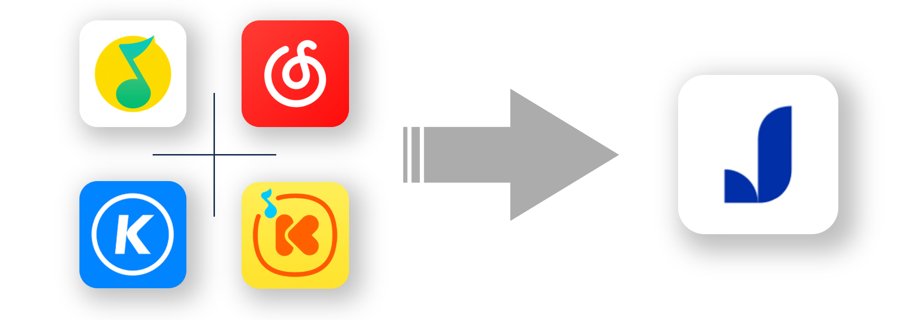

<h3 align="right">中文 / <a href="README_ENG.md">English</a></h3>
<p align="center">
    
</p>
    <h2 align="center">欢迎使用 椒盐歌单助手</h2>

---

### 项目介绍

现在，已经有大量用户将主力使用的音乐软件从**在线音乐平台**转为了**本地音乐播放器**，虽然歌曲可以很顺利且快速地进行迁移操作，但是无法将自己创建的歌单、或者其他用户的优秀歌单一并进行快速迁移操作，这个项目就是为了解决这个问题而诞生的。

- 原计划基于CLI实现，但由于Windows终端的编码问题，导致无法正常显示中文/韩文/日文等字符，所以现在改为使用前后端分离来实现。
- 重构版 前端仓库：[SaltPlayerConverterFrontEnd](https://github.com/Winnie0408/SaltPlayerConverterFrontEnd)
- 重构版 后端仓库：[SaltPlayerConverterBackEnd](https://github.com/Winnie0408/SaltPlayerConverterBackEnd)
- 若您出于各种原因不太想使用前后端重构版，并能够使用Linux或者Mac OS系统，那么您可以使用CLI版，匹配的核心算法是相同的，详情请查看[CLI版README](README_CLI.md)。

### 视频教程

~~哔哩哔哩（已被B站下线）：[椒盐音乐 歌单助手 使用指北](https://www.bilibili.com/video/BV1Tw411s7aL/)~~

YouTube：[椒盐音乐 歌单助手 使用指北](https://youtu.be/w2UMsPFbOro)

### 需要使用的硬件与软件

#### 硬件

- 电脑或其他中大屏(普通平板大小及以上)横屏设备 *1
- Android设备：
    - 若使用的主力设备**已获取**Root权限，则只需要一台即可，**无视**后文中主力机与备用机的区分。
    - 若使用的主力设备**未获取**Root权限，则需要两台设备：
        - 一台获取了Root权限的Android设备，真机或虚拟机皆可，后文中称其为**备用设备**。
        - 一台主力Android设备，后文中称其为**主力设备**。

#### 软件

本项目需要配合以下软件一起使用：

- 现代的浏览器（拥有一个即可）
    - [Google Chrome](https://www.google.cn/chrome/)
    - [Microsoft Edge](https://www.microsoft.com/zh-cn/edge)
    - [Firefox](https://www.mozilla.org/zh-CN/firefox/new/)
    - [Safari](https://www.apple.com.cn/safari/)
    - [Opera](https://www.opera.com/zh-cn)
    - 系统自带的浏览器
- 受支持的[在线音乐平台](README.md#音乐平台的选择)的Android客户端（均为普通版本，选择自己使用的一个或多个平台）
    - [网易云音乐](https://music.163.com/)**（推荐）**
    - [QQ音乐](https://y.qq.com/)**（推荐）**
    - [酷狗音乐](https://www.kugou.com/)
    - [酷我音乐](https://www.kuwo.cn/)
- 音乐标签
    - [Windows](https://www.cnblogs.com/vinlxc/p/11347744.html)
    - [Android](https://www.coolapk.com/apk/com.xjcheng.musictageditor)**（推荐）**
- 获取ID3标签（下载Release页面中的app-release.apk即可）
    - [Android (项目介绍)](https://github.com/Winnie0408/MusicID3TagGetter)
    - [Android (下载页面)](https://github.com/Winnie0408/MusicID3TagGetter/releases)
- 文件管理器（选择一个即可）
    - [MT管理器](https://www.coolapk.com/apk/bin.mt.plus)**（推荐）**
    - [ES文件浏览器](https://www.coolapk.com/apk/com.estrongs.android.pop)
    - [MiXplorer](https://mixplorer.com)
- Android虚拟机（当前使用的主力设备**未获取**Root权限时需要，选择一个即可）
    - [VMOS Pro](https://www.coolapk.com/apk/com.vmos.pro)：在手机上使用的虚拟机 ~~（可能需要使用VIP版，详情查看该应用的酷安评论区）~~
    - [MuMu模拟器](https://mumu.163.com)：在电脑上使用的虚拟机
- 椒盐音乐（或糖醋音乐）

## 使用方法

> **Note**
>
> **强烈推荐**您将本README文件完整阅读后，再进行相关操作！

### 0. 准备工作

安装上述软件

- **在线音乐平台客户端**与**文件管理器**，安装到有Root权限的设备（或虚拟机）上。
- **音乐标签**、**获取ID3标签**、**椒盐音乐**、文件管理器（可选），安装到主力设备上。
- 现代的浏览器，安装到电脑或其他中大屏设备上。

### 1. 获取在线音乐平台的歌单数据

**（在备用设备上操作）**

1. 打开需要使用的在线音乐平台客户端APP。
2. 登录账号。
3. **依次**点击进入自己的所有歌单（或者需要导出的歌单），并滑动到歌单页的**最底部**，加载当前歌单的所有歌曲。
4. 重复上述步骤，直到要所有导出的歌单**都加载过一次**。
5. 主动关闭在线音乐平台客户端（在软件菜单中选择**关闭**\[推荐\]，或直接在后台界面中将其划掉）。
6. 打开文件管理器，**授予Root权限**，进入在线音乐平台客户端的**数据目录**，找到**databases**文件夹，找到指定的数据库文件。<br>
   *若觉得各个软件的数据目录比较难找，可以使用MT管理器快速定位：`点击左上角菜单-点击安装包提取-选择需要的音乐APP-点击数据目录1`，即可快速跳转到数据目录。*
    - 网易云音乐
        - 数据目录：`/data/user/0/com.netease.cloudmusic/databases`
        - 数据库文件：`cloudmusic.db`
    - QQ音乐
        - 数据目录： `/data/user/0/com.tencent.qqmusic/databases`
        - 数据库文件：`QQMusic`
    - 酷狗音乐
        - 数据目录：`/data/user/0/com.kugou.android/databases`
        - 数据库文件：`kugou_music_phone_v7.db`
    - 酷我音乐
        - 数据目录：`/data/user/0/cn.kuwo.player/databases`
        - 数据库文件：`kwplayer.db`
7. 将数据库文件发送到电脑或其他中大屏设备上。

### 2. 刷新本地音乐的标签（ID3 Tag）信息

> **Warning**
>
> 本步骤会**覆盖**您本地音乐的ID3标签信息，**请谨慎操作**！
>
> 若您之前已经自行匹配（或修改）过歌曲的ID3信息，可跳过本步骤。
>
> 若后续匹配结果不理想，再重新进行此步骤即可。

**（在主力设备上操作）**

1. 将音乐文件保存在手机里（相信您已经完成这个步骤了）。
2. 打开**音乐标签**APP。
    1. 点击右上角**刷新**按钮，令其扫描手机中的音乐文件。
    2. 点击左上角**菜单**按钮，点击弹出菜单底部的**设置**。
    3. 点击**组合标签源**，**仅启用**与歌单来源平台**对应的**数据源，点击确定（比如，歌单来源平台为**网易云音乐**，则只启用**网易云**标签源，其他标签源都应**禁用**，若歌单来源平台为**酷狗音乐**，则启用**QQ与酷我**标签源，且QQ的优先级**高于**酷我）。
    4. 返回到音乐标签主界面，点击右下角的**编辑**按钮，点击**自动匹配标签**。
    5. 在弹出的对话框中，**仅勾选**标题、艺术家、专辑，**并同时启用**其右侧的覆盖选项，按需调整“网络搜索线程数”，点击确定。
    6. 等待音乐标签批量匹配完成。

### 3. 获取本地音乐的标签（ID3 Tag）信息

**（在主力设备上操作）**

1. 打开**获取ID3标签**APP。
    1. 点击下方的**选择目录**按钮，根据提示授予所需权限。
    2. 选择音乐存放的目录（具体选择方式请查看[这里](https://github.com/Winnie0408/MusicID3TagGetter/blob/master/README.md#使用方法)），点击屏幕底部的**使用此文件夹**，在弹出的对话框中点击**允许**。
    3. 等待软件扫描并导出手机中音乐的ID3标签信息。
    4. 前往软件的**导出目录**（手机存储目录中的Download目录）查看导出的ID3标签信息文件**本地音乐导出.txt**。
    5. 将导出的ID3标签信息文件发送到电脑或其他中大屏设备上。

### 4. 进行歌单转换操作

**（在电脑或其他中大屏设备上操作）**

1. 打开[椒盐歌单助手](https://saltconv.hwinzniej.top:45999/)页面。（或[使用其他运行项目的方法](README.md#项目的使用与运行)）
2. 按照您的意愿，开启或关闭**允许发送统计数据**[（会发送哪些数据？）](README.md#发送的统计数据)，点击**开始**按钮。
3. 选择**歌单来源**，点击下一步。
4. 上传**本地音乐导出.txt**文件，点击下一步。
5. 上传**数据库**文件，点击下一步。
6. 选择您本次要转换的歌单，点击下一步。
7. 根据您的需要，在页面左侧调整匹配的参数与设置，然后点击**预览歌单**按钮。
8. 在页面右侧查看匹配结果，若您对匹配结果不满意，可以重新调整参数与设置并再次点击**预览歌单**按钮，若您对匹配结果满意，点击**导出歌单**。
9. 若自动匹配的结果无法很好地满足您的需求，您可点击**跳转到第一个匹配失败的项**按钮，表格就会自动滚动并展开第一个匹配失败歌曲的详情，根据您的需要点击：
    - **相同**按钮：详情中展示的匹配结果正确（只是相似度没达到您设置的阈值要求）。（点击按钮立即生效）
    - **编辑**按钮：详情中展示的匹配结果错误，且您的本地歌曲中**有**歌单中对应的歌曲，您可以在弹窗中手动修改匹配结果。（在弹出的弹框中点击**确认**按钮后，该操作才生效）
    - **放弃**按钮：详情中展示的匹配结果错误，且您的本地歌曲中**无**歌单中对应的歌曲，您可以放弃匹配该歌曲。（在弹出的弹框中点击**确认**按钮后，该操作才生效）
        - 弹框中可以开启**放弃当前歌单所有自动匹配失败的歌曲**，若您启用该项，则该歌单中所有**自动匹配失败**（表格最右侧列为红色的**否**）的歌曲项将从表格（转换结果）中删除。
10. 重复第9步，直至当前歌单所有（自动匹配失败的）歌曲您都检查过一遍，点击**保存当前歌单**按钮，在弹窗中选择要保存的类型，并预览转换结果，完成后点击保存，保存完成后会自动开始下一个歌单的匹配操作。
11. 若您不想转换当前歌单了，可以点击**放弃当前歌单**按钮，会自动开始下一个歌单的匹配操作。
12. 若您第6步中选择的所有歌单全部匹配完成，会弹出**匹配完成**弹框，点击**确认**按钮，会跳转到下载转换结果页面。
13. 在下载转换结果页面，点击**下载转换结果**按钮，即可下载包含转换结果的压缩文件。
14. 您看选择**手动删除**您本次转换操作中使用的所有文件：数据库文件、本地音乐导出文件、转换结果压缩文件（若您没有手动删除，这些文件也将在3天后**自动删除**）。
15. 将压缩文件（解压后）发送到主力设备上。

### 5. 将歌单导入椒盐音乐

**（在主力设备上操作）**

1. 打开**椒盐音乐**APP。
2. 右滑或点击右上角菜单按钮，进入**菜单**，点击**歌单**。
3. 点击**导入歌单 (.txt)**。
4. （将压缩文件解压，）**逐个选择**压缩文件中的转换结果文件，将其导入到椒盐音乐中。
5. 在椒盐音乐中查看导入的歌单。

---

## 其他事项

### 项目的使用与运行

#### 1. 直接使用我提供的服务

[椒盐歌单转换助手](https://saltconv.hwinzniej.top:45999/)

#### 2. 自行从源码编译运行

过程比较繁琐，不推荐普通用户使用，故不在本项目的README中介绍，对项目感兴趣的大佬可见：

前端：[SaltPlayerConverterFrontEnd](https://github.com/Winnie0408/SaltPlayerConverterFrontEnd)

后端：[SaltPlayerConverterBackEnd](https://github.com/Winnie0408/SaltPlayerConverterBackEnd)

#### 3. 自行使用Docker运行

1. 运行命令，从Docker Hub拉取镜像，使用镜像创建并运行容器

**(推荐)**

```bash
docker run -d -it --shm-size=2G -p 45999:45999 -p 46000:46000 -e TZ=Asia/Shanghai --name salt-converter hwinzniej/salt-converter:latest
```

或

```bash
docker run -d -it --shm-size=2G --net=host -e TZ=Asia/Shanghai --name salt-converter hwinzniej/salt-converter:latest
```

2. 打开浏览器，访问

```text
http://127.0.0.1:45999/
```

---

##### P.S.

1. 若`45999`或/与`46000`端口被占用，可手动修改容器映射到宿主机的端口。如：修改为`55999`与`56000`：

```bash
docker run -d -it --shm-size=2G -p 55999:45999 -p 56000:46000 -e TZ=Asia/Shanghai --name salt-converter hwinzniej/salt-converter:latest
```

2. 若您的机器内存小于2G，可能需要修改共享内存的大小。如：改为`1G`：

```bash
docker run -d -it --shm-size=1G -p 45999:45999 -p 46000:46000 -e TZ=Asia/Shanghai --name salt-converter hwinzniej/salt-converter:latest
```

3. 若需要停止容器，可使用

```bash
docker stop salt-converter
```

4. 若需要启动容器，可使用

```bash
docker start salt-converter
```

### 发送的统计数据

**不包含**您的任何隐私数据，仅包含以下信息：

- 当前会话的Session ID（随机生成）
- 开始转换的时间
- 结束转换的时间
- 匹配模式（总体/分离）
- 歌单来源
- 当前歌单包含的歌曲数量
- 匹配成功的歌曲数
- 自动匹配成功歌曲数量
- 使用的相似度阈值
- 括号去除是否启用
- 歌手匹配是否启用
- 专辑匹配是否启用
- 最终保存了多少首歌曲

### 匹配模式

例如：

歌单中歌曲的信息如下：

歌名：小幸运

歌手：田馥甄

专辑：我的少女时代 电影原声带

---

本地歌曲的信息如下：

歌名：小幸运

歌手：田馥甄

专辑：我的少女时代 电影原声大碟

#### 总体匹配

将歌曲的[歌名] [歌手] [专辑]拼接成一个字符串，进行匹配，找到相似度最大的歌曲。表格中将显示整体匹配的相似度。

本匹配方法将使用：

`小幸运田馥甄我的少女时代 电影原声带`

与

`小幸运田馥甄我的少女时代 电影原声大碟`

进行匹配，相似度结果为：89.47%。

#### 分离匹配

将歌曲的[歌名] [歌手] [专辑]分别进行匹配， 找到相似度最大的歌曲。 表格中将显示每个匹配项的相似度。

本匹配方法将分别使用：

- `小幸运`与`小幸运`
- `田馥甄`与`田馥甄`
- `我的少女时代 电影原声带`与`我的少女时代 电影原声大碟`

进行匹配，相似度结果分别为：

- 100%
- 100%
- 84.62%

### 括号去除

大部分音乐平台对外语歌曲信息的命名方式一般为： `外文 (中文翻译)`或`外文 (歌曲来源、歌曲版本等)`。如`City Of Stars (From "La La Land" Soundtrack)`、`CALL ME BABY (叫我) (Chinese Ver.)`、`桜色舞うころ (樱花纷飞时)`。

启用此功能可以将字符串中的括号部分删去，只保留外文名，即：`外文`。如：`City Of Stars`、`CALL ME BABY`、`桜色舞うころ`，以此提高自动匹配成功率。

但需要注意，部分歌曲会在歌名后用括号注明歌曲版本：`歌名 (歌曲版本)`。如`曾经我也想过一了百了 (Live)`、`TruE (Ed Ver.)`，在这种情况下，若启用了本功能，会将其变成：`曾经我也想过一了百了`、`TruE`，继而**可能会出现匹配错误**。

请您根据您的实际情况，决定是否使用本功能。

### 音乐平台的选择

#### **网易云音乐** 与/或 **QQ音乐**

这两个平台的歌曲信息正确率较高，且较为完整、权威，可以有效提高自动匹配的成功率。

#### 酷狗音乐

该平台歌曲信息不太符合规范，合唱歌曲的艺术家名使用`、`分隔，且括号、斜杠的使用比较混乱，且**非【我喜欢】歌单**中歌曲的专辑信息不会保存到数据库中，导致匹配精确度下降，不太建议使用。

#### 酷我音乐

该平台歌曲信息不太符合规范，合唱歌曲的艺术家名使用`&`分隔，且括号、斜杠的使用比较混乱，且有很多用户自行上传的歌曲，这些歌曲的ID3信息大部分都不完整且不合规范，可能导致匹配精确度下降，不太建议使用。

### 相似度阈值

程序认为两个字符串**相同**的相似度大小，详情：

若当前阈值为0.8：

- **相同**<br>
  字符串1：想いの眠るゆりかご (回忆长眠的摇篮)<br>
  字符串2：想いの眠るゆりかご (回忆长眠的摇篮)<br>
  相似度：1.0

- **相同**<br>
  字符串1：伤感 II<br>
  字符串2：伤感 I<br>
  相似度：0.8

- **不相同**<br>
  字符串1：I'M OK<br>
  字符串2：I AM OK<br>
  相似度：0.7142857142857143

- **不相同**<br>
  字符串1：BANG BANG BANG (뱅뱅뱅)<br>
  字符串2：BANG BANG BANG<br>
  相似度：0.7

- **不相同**<br>
  字符串1：이 사랑 (这份爱) (Inst.)<br>
  字符串2：이 사랑 (这份爱)<br>
  相似度：0.5555555555555556

- **不相同**<br>
  字符串1：aaabbbccc<br>
  字符串2：abcabcabc<br>
  相似度：0.33333333333333337

## 赞助与支持

🥰🥰🥰

如果这个项目对您有所帮助，您可以给我一颗免费的⭐，或者请我喝杯咖啡！<br>
非常感谢您的支持！ <br>
⬇️⬇️⬇️<br>
<a href="markdownResources/Alipay WeChatPay.jpg">

</a>

